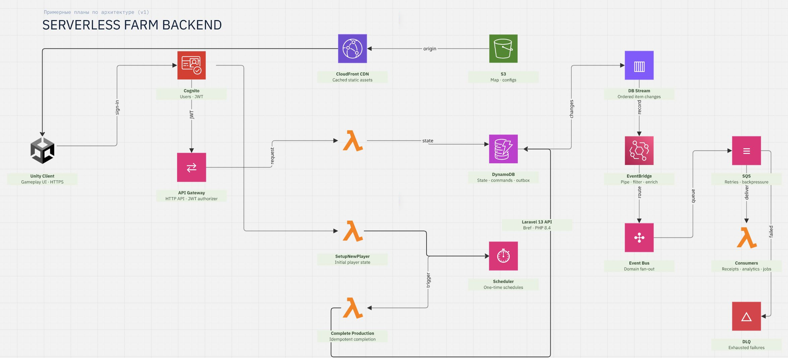

# Serverless Game Backend

Serverless-бэкенд для Unity-игры на Laravel 13, Bref и AWS. Основное хранилище проекта — DynamoDB; локальная разработка полностью изолирована в Docker.

## Архитектура



## Быстрый старт

```bash
make init
```

Команда создаст `.env`, соберёт образы, установит Composer/npm-зависимости в Docker volumes, сгенерирует `APP_KEY` и запустит сервисы.

После запуска доступны:

- Laravel API: <http://localhost:8000>;
- Vite asset-server: `http://localhost:5173`;
- DynamoDB Local с хоста: <http://localhost:8001>;
- DynamoDB Local из контейнеров: `http://dynamodb:8000`.

Порты можно изменить через `APP_PORT`, `VITE_PORT` и `DYNAMODB_PORT` в `.env`.

## Сервисы

| Сервис | Назначение |
| --- | --- |
| `app` | PHP 8.4, Composer, Laravel HTTP server и Artisan |
| `node` | Node.js, npm и Vite с HMR |
| `dynamodb` | DynamoDB Local с постоянным именованным volume |

## Make-команды

```bash
make help
make up
make down
make restart
make ps
make logs
make shell
make test
make format
make assets
make quality
```

Команды с аргументами:

```bash
make artisan ARGS="route:list"
make composer ARGS="show --direct"
make npm ARGS="outdated"
```

После изменения `composer.lock` или `package-lock.json` выполните `make install`. Для полной пересборки образов без cache используйте `make rebuild`.

`make down` сохраняет зависимости и данные DynamoDB. `make destroy` удаляет все volumes проекта и требует явного подтверждения.

## Проверка проекта

```bash
make quality
```

Команда валидирует и проверяет Composer/npm-зависимости, запускает PHPUnit и собирает frontend assets.
